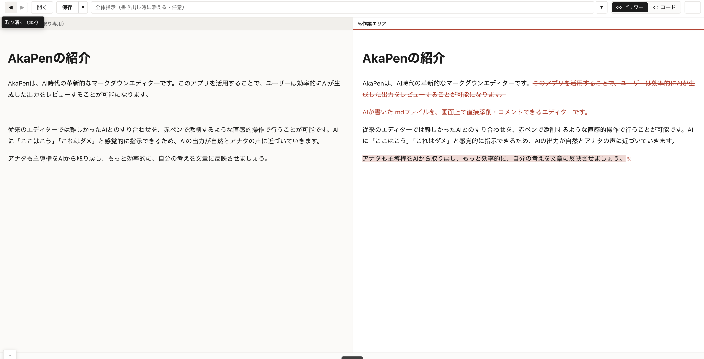

# AkaPen

AIに書かせた文章を読んで。「惜しい。だいぶ良い線いってるんだけど、どこか自分の声じゃないし、自分の思いや考えが含まれてなくて使えない。」と感じることがあると思います。

で、そのたびにプロンプトを書き直し、再生成して、でも結局どこか違う。概ね良い文章ではあるんだけど、細かく修正したい箇所が多くあり、それをプロンプトで伝え直すのは地味にしんどい。

AIを使っていると、そんな場面ありませんか？

やっていることの構造はシンプルで、AIの出力に添削を入れて戻すフィードバックループです。このループが軽く回るほど、出力は速く書き手の言葉に収束していく。AkaPenは、そのループを最短にするエディターです。AIの文章をあなたの言葉に近づけていく——そんな思想で作りました。

削除には赤の取り消し線、追記には赤字、コメントには蛍光ペンと欄外注がつきます。操作は直感的ですが、裏側ではLLMが正確に解釈できる構造化データとして記録されます。添削結果は別のマークダウンファイル(.akapen.md)として出力され、AIにそのまま渡せます。



添削内容はCriticMarkup記法——削除は `{--テキスト--}`、追記は `{++テキスト++}` のように、変更の種類と範囲をマークアップで明示する書式——で構造化されます。Claude CodeでもCodexでも、CriticMarkupを読めるLLMエージェントなら「どこを」「どう直したいか」が一発で伝わります。プロンプト欄に修正指示を長々と書く必要はありません。

データはすべてローカルで処理され、外部サーバーには送信されません。特定のLLMサービスにも依存しないため、好きなエージェントと自由に組み合わせて使えます。

ブロガーがAIの下書きを自分の文体に仕上げる。小説家がセリフのニュアンスを1語単位で詰める。ドキュメントの構造やトーンを整える。どの場面でも、添削を入れて戻すだけ。「AIの文章」が「自分の文章」になっていきます。

## インストール

```bash
npm install -g akapen
```

Node.js 18以上が必要。

## 起動

```bash
akapen ./draft.md
```

ローカルサーバーが立ち上がって、ブラウザで添削画面が開く。ファイルパスを省略すればブラウザ内のファイルピッカーで選べる。

## 添削の操作

- **削除** -- テキストを選択して削除ボタン。赤取り消し線で表示される。
- **追記** -- テキストを自由に入力。赤字で表示される。
- **コメント** -- テキストを選択してコメントを付ける。蛍光ペンと欄外注で表示される。
- **全体指示** -- 文書全体への指示を記入できる。
- **表示切替** -- プレビュー（WYSIWYG）とソース（Markdown直接編集）を切り替えられる。

編集内容は自動保存。途中で閉じても次回そのまま再開できる。

「完了」を押すと、元ファイルと同じディレクトリに `.akapen.md` が出力される。

## 出力形式

```markdown
{++追記された部分++}
{==対象テキスト==}{>>コメントや指示<<}
```

CriticMarkup記法で記録される。Claude Code、Codexをはじめ、CriticMarkupを読めるLLMエージェントならそのまま処理できる。

## ワークフロー例

```
1. LLMエージェントが .md 原稿を生成
2. akapen ./draft.md で開いて添削
3. 完了 → draft.akapen.md が出力
4. LLMエージェントに .akapen.md を渡して修正依頼
```

特定のLLMサービスには依存しない。

## ライセンス

AkaPen Source-Available License

- **個人の趣味、非営利での利用** -- 無料。
- **仕事や商用での利用** -- 収益につながる用途では有料ライセンスが必要。
- **1人1ライセンス** -- 譲渡・共有は不可。
- **再配布禁止** -- コピーの配布、別サービスへの組み込みは不可。

詳細は [LICENSE](./LICENSE) を参照。

## プラン

| | Free | Standard | Supporter |
|---|---|---|---|
| 基本機能 | ✓ | ✓ | ✓ |
| 利用範囲 | 個人、趣味 | 商用可 | 商用可 |
| 今後の機能更新、追加機能 | — | ✓ | ✓ |
| 同時利用デバイス数 | — | 2台 | 4台 |

StandardとSupporterに機能差はない。違いは同時利用デバイス数だけ。Supporterは開発者を応援してくれる人のためのプラン。

ライセンスの購入と管理はアプリ内の設定画面から。

## 動作環境

- Node.js 18以上
- macOS、Windows、Linux
- Chrome、Firefox、Safari、Edge
